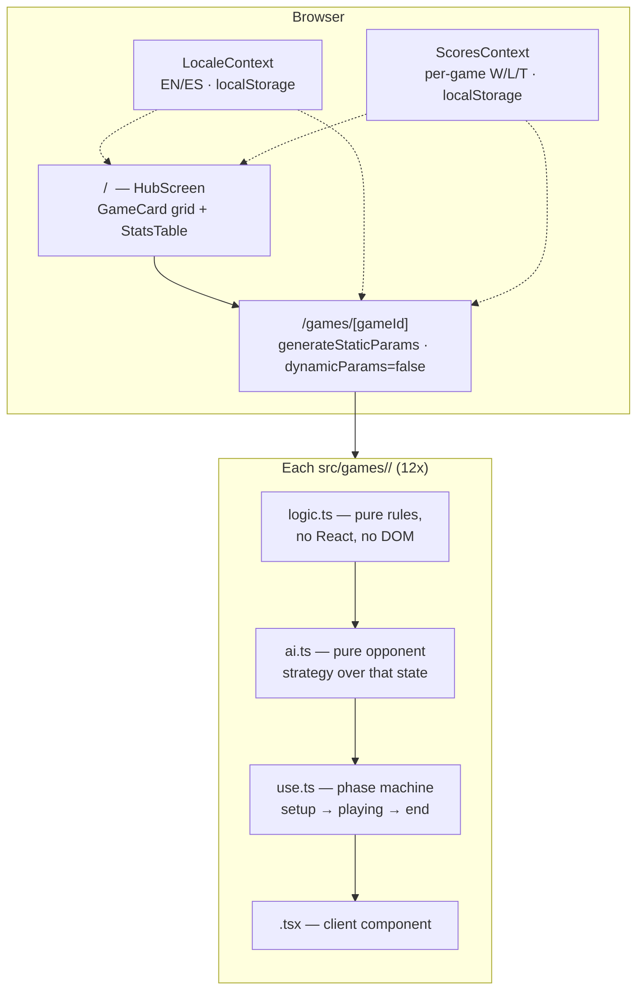

<div align="center">

# 🎮 Mini-Game Hub — You vs AI

### **Twelve browser mini-games sharing one hub, one scoreboard and one bilingual UI — each played against an AI opponent built on a genuinely different algorithm, from XOR nim-sum game theory to alpha-beta search to information-gain letter picking.**

[](https://nextjs.org/)
[](https://react.dev/)
[](https://www.typescriptlang.org/)
[](https://eslint.org/)


<br/>

<!-- Screenshots pending — will be added here once available. -->

</div>

---

Mini-Game Hub is a client-side Next.js application with **zero runtime dependencies beyond Next.js and React** — no UI kit, no state-management library, no audio-asset pipeline. Every pixel, sound and AI decision is hand-written. The project exists to demonstrate the same thing twelve different ways: given a small, well-defined game, design an opponent whose difficulty tiers are the result of an actual algorithm — minimax with alpha-beta pruning, combinatorial game theory, Bayesian-ish letter selection, exact card counting — not a random-number fudge factor.

**Author:** Joan V. Oliver Rosell
**License:** Proprietary — source is public for portfolio/evaluation purposes only, see [LICENSE](LICENSE)

---

## Table of contents

1. [Games & AI opponents](#1-games--ai-opponents)
2. [Screenshots](#2-screenshots)
3. [Architecture](#3-architecture)
4. [Tech stack](#4-tech-stack)
5. [Inside the AI — six strategies in depth](#5-inside-the-ai--six-strategies-in-depth)
6. [Project structure](#6-project-structure)
7. [Adding a new mini-game](#7-adding-a-new-mini-game)
8. [Getting started](#8-getting-started)
9. [Engineering principles](#9-engineering-principles)
10. [Roadmap](#10-roadmap)
11. [Author](#11-author)

---

## 1. Games & AI opponents

Every game exposes three difficulty tiers. "Hard" is never a stat multiplier — it is the AI actually computing the best move it can find in real time, client-side, inside a React render loop.

| Game | Route | AI strategy |
|---|---|---|
| 🔢 Number Duel | `/games/guess` | Binary search over the public candidate interval — Hard converges in ⌈log₂(range)⌉ guesses |
| ✊ Rock · Paper · Scissors | `/games/rps` | Blended predictor: overall + recency-weighted move frequency, a one-step Markov transition table, and repeated two-move pattern detection |
| ⭕ Tic-Tac-Toe | `/games/ttt` | Three-mark movement variant; depth-limited **minimax + alpha-beta pruning** with a heuristic board evaluator and transposition cache |
| 🃏 Higher or Lower | `/games/higher-or-lower` | Hard does exact O(n) card-counting over the real remaining deck; Medium reasons from the nominal 52-card distribution only |
| 🧠 Memory Match | `/games/memory-match` | The AI never inspects hidden tiles — it *observes* flips and retains them at a difficulty-tuned probability (30% / 60% / 93%), like a fallible human memory |
| 🔴 Connect Four | `/games/connect-four` | **Minimax + alpha-beta** over a windowed threat-scoring heuristic (open threes, double threats, center control), center-first move ordering, 6-ply search on Hard |
| 🪵 Nim | `/games/nim` | Exact **nim-sum (XOR) optimal play** (Bouton's theorem, 1901) for both normal and misère rulesets, including the misère endgame parity flip |
| 🔤 Word Guess | `/games/word-guess` | Filters the live candidate-word pool against every hit/miss, then picks the letter that most evenly bisects it — an **information-gain** heuristic |
| 🃏 Blackjack | `/games/blackjack` | Dealer plays a fixed casino rule; difficulty only gates a basic-strategy Hit/Stand hint shown to the player on Easy |
| ⚡ Reaction Time | `/games/reaction-time` | Simulated human reflex window (150–700 ms) tuned per difficulty, with a false-start chance |
| ⚽ Penalty Shootout | `/games/penalty-kick` | Pre-commit keeper AI, pattern learning and three balanced shot techniques |
| 🏀 Basket Challenge | `/games/basket-shot` | Release-timing meter for the player; difficulty-scaled make probability for the AI (42% / 58% / 74%, −11% on three-pointers) |

Full breakdown of the six search/probability-driven opponents — the ones with a real algorithm behind them — in [§5](#5-inside-the-ai--six-strategies-in-depth).

---

## 2. Screenshots

> Screenshots are being captured and will be added to this section, formatted as a gallery consistent with the other portfolio projects.

---

## 3. Architecture

A single Next.js App Router application, no backend of its own. Persistence is entirely client-side (`localStorage`); every game route is statically generated at build time.



**Key decisions:**

- **Static by construction.** `src/app/games/[gameId]/page.tsx` sets `dynamicParams = false` and generates one page per entry in the game registry at build time — any unregistered id 404s, there is no dynamic catch-all.
- **Registry-driven UI.** The hub grid, the `/games/<id>` routes and the scoreboard rows are all *derived* from `src/games/registry.ts` — nothing about the game list is hardcoded into a component.
- **Logic isolated from React.** Every game's `logic.ts` (state transitions) and `ai.ts` (opponent strategy) are plain, framework-free TypeScript — deterministic given a seed, and unit-testable without mounting anything.
- **Two small global contexts, no store library.** `LocaleContext` and `ScoresContext` both follow the same SSR-safe pattern: initialize to a fixed default for the server render, hydrate from `localStorage` in a post-mount `useEffect`, so there is never a hydration mismatch on first paint.
- **Additive score schema.** `ScoresContext.record(gameId, outcome)` has no dependency on the game registry — a brand-new game id gets a zeroed win/loss/tie row automatically on its first recorded result.

---

## 4. Tech stack

| Layer | Choice | Why |
|---|---|---|
| **Framework** | Next.js 16 (App Router, Turbopack) | Static generation per game route, zero server to operate |
| **Language** | TypeScript (strict) | End-to-end type safety, including a `satisfies`-checked i18n dictionary |
| **UI runtime** | React 19 | Server + Client Components; every game screen is a small client-side state machine |
| **Styling** | Hand-written CSS (`globals.css`) | Custom-property design tokens, zero utility-CSS or component-library dependency |
| **State** | React Context + `localStorage` | Two contexts (locale, scores) are all the shared state this app needs — no external store |
| **Audio** | Native Web Audio API (`lib/sound.ts`) | Four synthesized cues (win/lose/error/blip), no audio asset files |
| **i18n** | Custom typed dictionary (`lib/i18n/dictionaries.tsx`) | `satisfies Dictionary` on both locales — a missing/extra key is a compile error, not a runtime blank string |
| **Tooling** | ESLint 9 (flat config, `eslint-config-next`) | `core-web-vitals` + `typescript` rule sets, zero custom overrides |

---

## 5. Inside the AI — six strategies in depth

Six of the twelve opponents are driven by an actual algorithm rather than a probability roll. This is the part of the project worth reading the source for.

#### Minimax + alpha-beta pruning — Tic-Tac-Toe & Connect Four
Both games share the same shape: a depth-limited [`minimax`](src/games/connect-four/ai.ts) search with alpha-beta pruning and a `Map`-based transposition cache keyed on board state. Connect Four adds **move ordering** (center columns searched first — `[3, 2, 4, 1, 5, 0, 6]`), which both improves play quality and dramatically increases the pruning rate, and a **windowed threat heuristic** that scores every open four-cell line, penalizing the opponent's threats more heavily than symmetric AI opportunities. Hard mode searches 6 plies on a 7×6 board — deep enough to be genuinely hard to beat without blocking the UI thread.

#### Nim-sum (XOR) optimal play — Nim
A self-contained implementation of Bouton's 1901 theorem: the bitwise XOR of all pile sizes (the *nim-sum*) tells you, with mathematical certainty, whether the player to move is winning. [`findNormalOptimalMove`](src/games/nim/ai.ts) reduces a pile so the nim-sum returns to zero, at least one of which is always legal whenever the position is won. The trickier part is **misère play** (last player to move *loses*): the strategy tracks the same nim-sum right up until every pile is size 0 or 1, at which point the correct move flips to a parity game on the count of remaining single-token piles — implemented as its own three-case branch.

#### Blended move prediction — Rock · Paper · Scissors
Hard mode scores the player's next move from four independent signals — overall move frequency, a recency-weighted window over the last six rounds, a one-step **Markov transition table** keyed on the player's previous move, and detection of a repeated two-move sequence — then counters the highest-scoring prediction. A small (8%) random floor keeps the predictor itself from becoming a pattern the player can exploit back.

#### Information-gain letter selection — Word Guess
[`pickInformationLetter`](src/games/word-guess/ai.ts) filters the live candidate word list against every revealed hit and miss, then — rather than guessing the statistically most frequent letter — scores each remaining letter by how evenly it **bisects** the candidate pool. A letter that splits 50 remaining words into 25/25 eliminates more uncertainty than one that splits them 49/1, regardless of which side the true answer falls on.

#### Exact card counting — Higher or Lower
Medium reasons from the nominal 52-card rank distribution with only the visible card removed. Hard instead runs an O(n) pass over the *actual* remaining deck ([`calculateRemainingProbabilities`](src/games/higher-or-lower/ai.ts)) and argmaxes over exact counts — no floating-point probability needed, since comparing counts is sufficient to pick the best of Higher/Lower/Same.

#### Fallible probabilistic memory — Memory Match
The AI is structurally incapable of cheating: it never reads tile values directly. [`observeTile`](src/games/memory-match/ai.ts) is the only way a value enters its memory, and it only "sticks" with a difficulty-tuned retention probability (30% / 60% / 93%) — modeling a human memory that sometimes fails to register what it just saw, rather than an oracle with an artificial miss chance bolted on.

---

## 6. Project structure

```
src/
├── app/
│   ├── layout.tsx              Root layout — Locale/Scores providers + header
│   ├── page.tsx                Hub (main menu)
│   ├── globals.css             Design tokens + shared component classes (~1.9k lines)
│   └── games/[gameId]/page.tsx Static route — generateStaticParams, dynamicParams=false
├── components/
│   ├── hub/                    AppHeader, HubScreen, GameCard, StatsTable
│   └── ui/                     SegPicker, Toggle, HowToPlay, InfoTip, BackLink
├── context/
│   ├── LocaleContext.tsx       EN/ES switch, localStorage-backed
│   └── ScoresContext.tsx       Per-game W/L/T store, localStorage-backed, legacy-data migration
├── games/
│   ├── types.ts                GameDefinition contract
│   ├── registry.ts             Central game list — see §7
│   ├── guess/                  logic.ts · ai.ts · useGuessGame.ts · GuessGame.tsx · index.ts
│   ├── rps/                    same structure
│   ├── ttt/                    same structure (minimax in ai.ts)
│   ├── higher-or-lower/        + types.ts, CardFace.tsx (shared with blackjack)
│   ├── memory-match/           + types.ts
│   ├── connect-four/           + types.ts
│   ├── nim/                    + types.ts
│   ├── word-guess/             + types.ts, words.ts, letters.ts
│   ├── blackjack/               hints.ts instead of ai.ts — the dealer's play is a fixed rule
│   ├── reaction-time/          + types.ts
│   ├── penalty-kick/           + types.ts
│   └── basket-shot/            + types.ts
└── lib/
    ├── i18n/dictionaries.tsx   All copy, EN + ES, typed via `satisfies Dictionary`
    ├── cards.ts                Deck primitives shared by higher-or-lower & blackjack
    ├── random.ts               randomInt(lo, hi)
    ├── sound.ts                WebAudio synth — win/lose/error/blip
    └── settings.ts             Session-only settings (AI "thinking" delay toggle)
```

Every game follows the same five-file layered pattern:

- **`logic.ts`** — pure rules and state transitions. No React, no DOM. Unit-testable in isolation.
- **`ai.ts`** — pure opponent strategy over that state (Blackjack keeps `hints.ts` instead, since its only "AI" surface is a player-facing hint).
- **`use<Name>.ts`** — the React hook owning the phase machine (`setup → playing → end`), timers, sound cues and score recording.
- **`<Name>.tsx`** — the client component rendering the three phases.
- **`index.ts`** — exports the `GameDefinition` (id, icon, `hasTies`, component).

---

## 7. Adding a new mini-game

1. Create `src/games/<id>/` following the five-file pattern above.
2. Register it in `src/games/registry.ts`:

   ```ts
   export const GAMES: GameDefinition[] = [guessGame, rpsGame, /* … */, myNewGame];
   ```

3. Add its display name and description under `gamesMeta.<id>` in `src/lib/i18n/dictionaries.tsx`, for **both** locales (`en` and `es`) — the `satisfies Dictionary` typing makes a missing entry a build-time error, not a silent blank.

That's it. The hub card, the `/games/<id>` route and the scoreboard row are all derived from the registry — `ScoresContext` creates a zeroed win/loss/tie entry for any new game id the first time `record()` is called on it.

---

## 8. Getting started

**Prerequisites:** Node.js ≥ 20, npm.

```bash
npm install
npm run dev      # http://localhost:3000 (Turbopack)
```

| Script | What it does |
|---|---|
| `npm run dev` | Starts Next.js in development with Turbopack |
| `npm run build` | Production build |
| `npm start` | Serves the production build |
| `npm run lint` | ESLint over the whole project |

---

## 9. Engineering principles

- **Difficulty is an algorithm, not a multiplier.** Where a game admits a real strategy (Tic-Tac-Toe, Connect Four, Nim, RPS, Word Guess, Higher or Lower), "Hard" runs that strategy at full strength — it is never simulated by inflating a hit chance.
- **The AI only ever sees what it's allowed to see.** Memory Match's AI has no code path that reads a hidden tile's value directly; Higher or Lower's Medium tier reasons from the nominal deck, not the real one — the *information asymmetry* is the difficulty knob.
- **Logic first, React second.** Every game's rules and AI live in framework-free `.ts` modules; the React hook is a thin state-machine wrapper on top. This is what makes twelve independent games maintainable by one person.
- **Type-checked content.** The bilingual dictionary uses `satisfies Dictionary` on both locales — English/Spanish key drift is a compile error, not a runtime gap discovered by a user.
- **SSR-safe client state.** Both global contexts hydrate from `localStorage` after mount rather than during the server render, so there is no hydration-mismatch warning and no flash of default state.
- **Zero incidental dependencies.** No UI kit, no state library, no audio files — every dependency in `package.json` is Next.js, React or their own tooling.

---

## 10. Roadmap

- **Automated tests** — the `logic.ts`/`ai.ts` split exists specifically to make the pure game rules and AI strategies unit-testable (Vitest is a natural fit); this coverage doesn't exist yet.
- **CI** — lint + test on every push once the test suite lands.
- **More games** — the registry pattern in §7 is designed for this; new opponents keep the "real algorithm per difficulty tier" bar from §9.

---

## 11. Author

**Joan V. Oliver Rosell** — full-stack engineering, game/AI logic design, i18n architecture.

[](https://www.linkedin.com/in/joanvoliver)
[](mailto:joanoliverrosell@gmail.com)
[](https://github.com/JoanOliver04)

---

<div align="center">
<sub>© 2026 Joan V. Oliver Rosell. All rights reserved. See <a href="LICENSE">LICENSE</a>.</sub>
</div>
